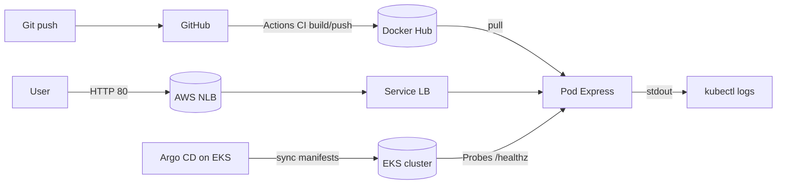

# demo-12-factor-app

12-Factor demo app para Live com Node.js + Express, Kubernetes (kind + Helm) e GitOps com Argo CD. Pipeline de CI com GitHub Actions para build/push da imagem no Docker Hub e disparo de deploy via GitOps.

## Guia: Pipeline no EKS
Consulte o passo a passo detalhado para executar a pipeline GitHub Actions + Argo CD + EKS em:
- `docs/pipeline-eks.md`

Para um início rápido e objetivo, veja também:
- `docs/quickstart.md`

## Guia: 12‑Factor na prática
Veja como cada fator se aplica a esta demo/hands‑on, com referências aos arquivos do repo:
- `docs/12-factor-app.md`

## Arquitetura (única)


## Stack
- Node.js 20 + Express
- Docker
- Kubernetes (EKS)
- Helm
- Argo CD (GitOps)
- Docker Hub (registry)
- GitHub Actions (CI)

## Executar local (sem Kubernetes)

```bash
# Pré-requisitos: Node 20, Docker
npm install
npm start
# ou via Docker
docker build -t demo-12-factor-app:local .
docker run --rm -p 3000:3000 -e PORT=3000 demo-12-factor-app:local
# Teste
curl http://localhost:3000/healthz
```

## EKS via CloudFormation (recomendado)

Se preferir usar CloudFormation puro (permitido no Learner Lab), o repositório inclui templates em `cloudformation/` e scripts de automação.

1. Pré-requisitos
```bash
aws --version
kubectl version --client
```

2. Variáveis obrigatórias
Recomendado: use um arquivo `ENV_FILE` (ex.: `env/cfn.fiapaws`) conforme `docs/quickstart.md`.

Se preferir exportar no shell:
```bash
export AWS_REGION=us-east-1 # ou us-west-2
# Opção A (comum no Learner Lab): usar LabRole para ambos os papéis
export CLUSTER_ROLE_ARN=arn:aws:iam::ACCOUNT_ID:role/LabRole
export NODE_ROLE_ARN=arn:aws:iam::ACCOUNT_ID:role/LabRole
# Opção B (se sua conta possuir roles dedicadas de EKS):
# export CLUSTER_ROLE_ARN=arn:aws:iam::ACCOUNT_ID:role/LabEksClusterRole
# export NODE_ROLE_ARN=arn:aws:iam::ACCOUNT_ID:role/LabEksNodeRole
```

3. (Opcional) Informar rede explicitamente
```bash
# Caso não queira autodiscovery da VPC default:
export SUBNET_IDS=subnet-aaaa,subnet-bbbb
export SECURITY_GROUP_IDS=sg-zzzzzz
```

4. Provisionar cluster e nodegroup
```bash
chmod +x scripts/deploy-cfn.sh scripts/destroy-cfn.sh
scripts/deploy-cfn.sh
```

5. Acessar a aplicação (NLB via Service LoadBalancer)
```bash
kubectl -n demo-12-factor-app get svc
# aguarde EXTERNAL-IP/hostname do Service
curl http://<EXTERNAL-HOSTNAME>/healthz
```

6. Teardown para economizar orçamento
```bash
scripts/destroy-cfn.sh
```

## CI: GitHub Actions + Docker Hub

1. Criar secrets no repositório GitHub:
- `DOCKERHUB_USERNAME`: seu usuário do Docker Hub
- `DOCKERHUB_TOKEN`: um Access Token do Docker Hub (ou senha, não recomendado)

2. Ajustar chart Helm
- Em `helm/demo-12-factor-app/values.yaml`, defina `image.repository` para o seu Docker Hub (ex.: `docker.io/<seu-usuario>/demo-12-factor-app`).

3. Fluxo
- Ao fazer push na branch `main`, a pipeline:
  - builda a imagem `docker.io/<username>/demo-12-factor-app`
  - publica tags: `latest` (na main), `sha-<shortsha>`, `sha-<longsha>` e tags de branch
  - atualiza `helm/demo-12-factor-app/values.yaml` com a nova tag longa (`sha-<longsha>`) e commita
  - Argo CD detecta a mudança e sincroniza o cluster

## 12-Factor demonstrados
- Codebase: repositório único
- Dependencies: declaradas em `package.json`
- Config: variáveis via `ConfigMap` (não sensível) e `Secret` opcional; por padrão não usamos Secret
- Backing services: não usamos DB por padrão; quando necessário, adicione `DATABASE_URL` via Secret e ajuste o app
- Build, release, run: imagem versionada + Argo CD aplica novo release
- Processes: stateless (dados na memória por enquanto)
- Port binding: HTTP escutando `PORT`
- Concurrency: `replicaCount`; HPA pode ser adicionado futuramente
- Disposability: graceful shutdown com SIGTERM/SIGINT
- Dev/prod parity: Docker local x EKS
- Logs: stdout (kubectl logs)
- Admin processes: sem Jobs por padrão; adicione um Job específico quando for necessário

## Extensões futuras (opcional)
- Postgres (RDS ou Helm chart) e migrations (adicionar Job e `Secret` com `DATABASE_URL`)
- Exposição via ALB/Ingress (instalar AWS Load Balancer Controller) quando precisar de camada 7

## Troubleshooting
- Se o cluster não puxa a imagem do Docker Hub, verifique `imagePullPolicy` e se o `values.yaml` está com `repository` correto.
- Em ambientes com IAM restrito (Learner Lab), usamos NLB automático via Service `type: LoadBalancer`. Caso necessário, como alternativa temporária, use `kubectl port-forward`.
- Para encerrar custos, sempre destrua o cluster com `scripts/destroy-cfn.sh` quando não estiver usando.
